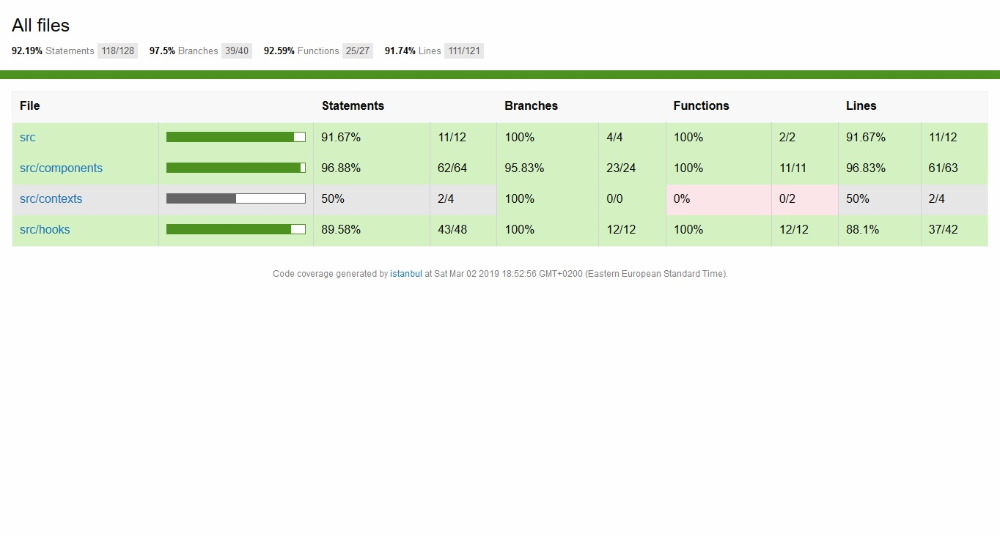

# istanbul-azure-reporter

Code coverage HTML reporter with Azure DevOps limitations in mind. 

Based on istanbuljs `html` built-in [reporter](https://github.com/istanbuljs/istanbuljs/tree/master/packages/istanbul-reports/lib/html).

## License

Released under the [MIT](LICENSE).
